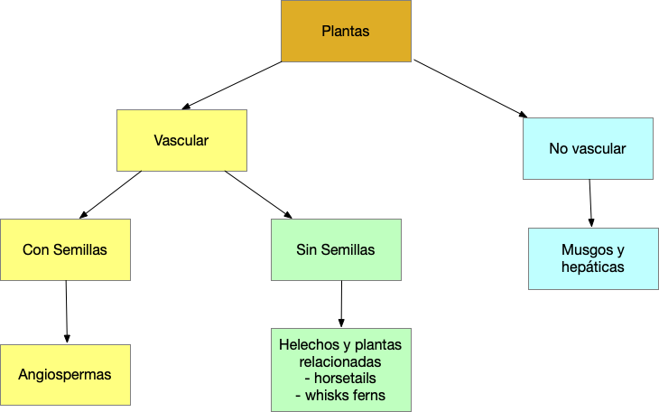

```{r setup, include=FALSE}
knitr::opts_chunk$set(echo = TRUE)
```
## Forma de Vida de las Plantas

#### Las Plantas tienen diferentes formas estructurales/forma de vida o sea arquitectura. 

Descripción de los tipos de estructura/arquitectura/forma de vida de las plantas

***


### Objetivos 1_A


#### Reconocer los grupos principales de plantas

```{r}

```
***
### Objetivos 2

**Definen y reconocer las siguientes forma de vida de las Plantas**


+	Lenõsas
	
    -	Arboles
    -	Arbustos
    - lianas (¿cual es la diferencia entre una enredadera y una liana?)
    
 +	Herbáceas   
 
    -	Herbáceas
    -	Suculentas
    -	Gramas
    - Juncias (sedges)
    - Enredaderas
      - herbaceas (sin lignina)
      
 + Localización
 
   - Terrestre
   - Epífitas (crece sobre otra plantas)
   - Litófitas (crece sobre piedras)
      
  
  Para más detalles vea estos enlaces:
  
[Vea este enlace para las formas de Vida de las Plantas](https://en.wikipedia.org/wiki/Habit_(biology))

[Vea este enlace para más definiciones con forma de vida de plantas](https://www.anbg.gov.au/cpbr/herbarium/collecting/habit-types.html)

Haz una lista de cada uno de estos términos y su definición, asegúrate que la definición sea especifica.  


    
***  

### Objetivos 3

Definen y reconocer las siguientes forma de vida de las Briofitas

+ ¿Cual son los tres grupos principal de briofitas?

+ ¿Como se diferencia estos grupos?


+ Briófitas [Bryophyte](https://en.wikipedia.org/wiki/Bryophyte)

[Vea un Musgos aqui](https://en.wiktionary.org/wiki/bryophyte#/media/File:Marchantia_polymorpha_190708.jpg)


  + Clasificación de Briófitas
   [Classification](https://www.toppr.com/ask/content/concept/classification-of-bryophytes-202047/)

    - foliose   [foliose](https://www.britannica.com/plant/bryophyte)
    - thallose  [thallus](https://en.wikipedia.org/wiki/Thallus) 


## Actividad práctico: Recorido del patio de la UPRH

## Actividad para entregar
  
  En el patio de su casa y vecindario.  Buscar los siguientes tipos de forma de planta
    
     + Tomar una fotos de estos tipos de forma de planta.
      -	Arboles
      -	Arbustos
      -	Herbáceas
      -	Suculentas
      -	Gramas
      - Juncias (sedges)
      - Enredaderas
        - lianas (¿cual es la diferencia entre una enredadera y una liana?)
        - herbaceas (sin lignina)
      
     + Identificar correctamente la forma de crecimiento para cada foto
      
      **Someter el trabajo por MSTeam. NO más tarde del día antes de la próxima clase a las 11:59pm.**
      
      El trabajo es individual ( 15 puntos)

        + El tarabajo tiene que ser sometido en forma de .html, word o pdf.
        + Bien organizado y profesional. 
          - Trabajos presentado de forma desorganizado tendrán automaticamente -5 en puntuación.
          
          
      


