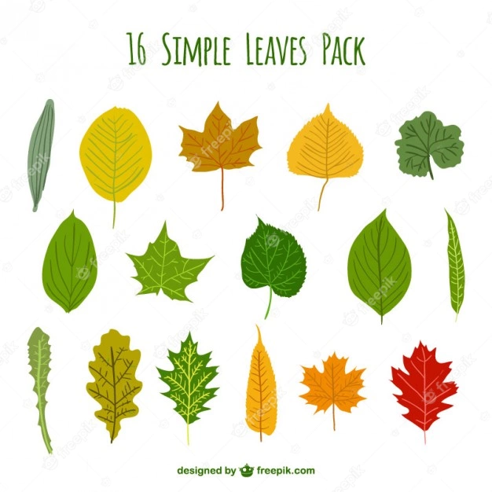
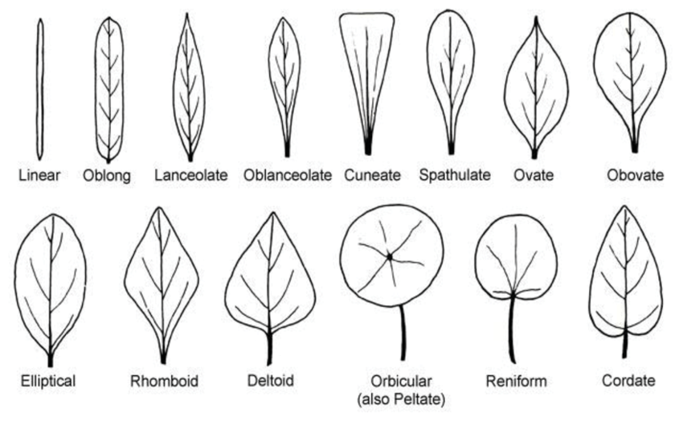
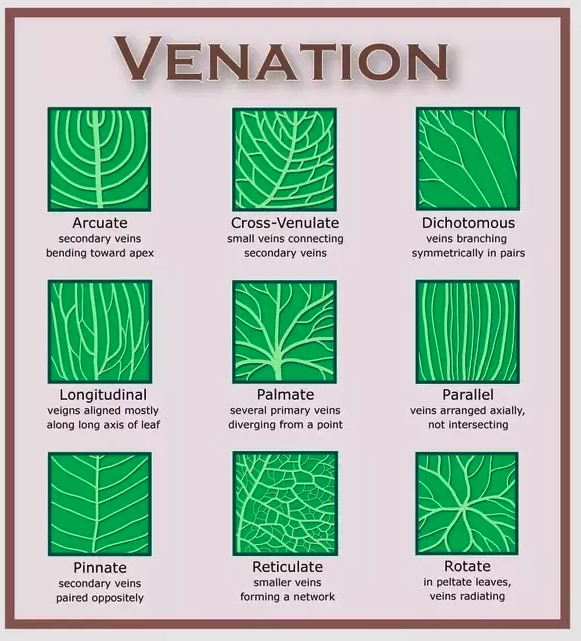

```{r setup, include=FALSE}
knitr::opts_chunk$set(echo = TRUE)
```

## Diversidad de Formas de Hojas

#### Organización de las Hojas
  + Composición de las Hojas
  +	Forma
  +	Margen
  +	Venación


### Objetivos

Reconocer una hojas compuesta y simples

Lo que define una hoja es donde se encuentra el meristemo axiliar.
 [Mersitem](https://en.wikipedia.org/wiki/Meristem)
 [diferencia entre simple y compuesto](https://biodifferences.com/difference-between-simple-and-compound-leaves.html)
 

 

|Variable |Hojas_simples | Hojas_Compuestas|
|:---------|-------:|--------:|
|**Definición** |La hoja en la que la lámina de la hoja no está dividida en lóbulos se llama hoja simple, y la disposición de tales hojas es en sucesión acropetal.|La hoja que muestra la división de la lámina en folíolos se denomina hojas compuestas. Estas hojas no hacen arreglos de sucesión acropetal de los folíolos.|
|**La lamina** | Es sencilla/unica | Tiene laminas pequeñas que se llama folíolos|
|**Yema axilar**|La yema se coloca en la axila, cerca del pecíolo y el tallo |Cada folleto no tiene axila, aunque los brotes se colocan en la axila de la hoja|
|**División en lamina**   |No hay división de lámina.    |  La lámina se divide en más de dos folíolos, que surgen en el costado de un raquis o en la punta del pecíolo.   |
|  **Estípulas**  |La base de una hoja contiene estípulas.|Las estípulas se encuentran en la base de la hoja, pero no existen otras estructuras adicionales.|
| | | | 


***

 + Hojas simples
  [De este website](https://www.freepik.com/premium-vector/simple-leaves-pack_818630.htm)
 
 
 ***
 
 + Hojas compuestas
  
     - [De este website](https://lizzieharper.co.uk/2013/10/botanical-illustration-compound-and-simple-leaves/)

***

## Forma de las Hojas

La forma de las hojas tienen términos para describir su forma.

[de este website](https://www.researchgate.net/figure/Examples-of-leaf-shapes_fig1_295685020)

***


## Diversidad de Margen de las Hojas

[de este website](http://www.bio.miami.edu/dana/pix/leafmargins.jpg)


***

## Venación de la Hojas

[de este website](https://www.quora.com/What-is-venation-of-a-leaf)


***

## Tarea para entregar 
#### (Día de entrega, el proximo día de laboratorio)


**Tomar una foto y Colectar y hacer un album de su colleción hojas.** Las plantas las pueden colectar de cualquier sitio (menos los bosques estatales y federales: NO TENEMOS PERMISO de recolectar en estos sitios)

 (@) hojas de 3 plantas con hojas sencillas
 
 (@) hojas de 3 plantas con hojas compuestas
 
 **Colectar, tomar fotos y dibujar la hojas**
 
 (@) de 6 diferentes forma de hojas
 

 **Colectar, tomar fotos y dibujar el margen de las hojas**
 
 (@) de 4 tipo de margen de plantas diferentes
 
  **Colectar, tomar fotos y dibujar la venación de las hojas**
  
(@) de 4 tipo de venación de plantas diferentes

***

**Entrega del trabajo**: Total de puntos (20)

+ El trabajo sera entregado en un documento digital (Word, .html, .pdf)
+ Cada lámina sera identificado con la información mencionada arriba. 
+ Las fotos deberían ser adecuada, en otra palabra que se puede demostrar las características mencionados y identificada, o sea, 
    - una foto de toda la hoja, 
    - de los detalles de la hoja, 
    - del borde de la hoja.
+ Cada lámina bien presentada, correctamente identificada vale un (1) punto. 
+ En cada pagina tendrá, la foto de la hoja, definición de las características y porque se describe con este termino.  


