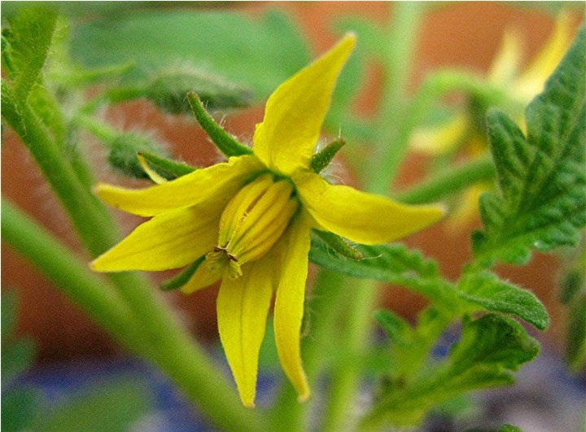

```{r setup, include=FALSE}
knitr::opts_chunk$set(echo = TRUE)
```


## Sexualidad floral

Este módulos es sobre reconocer en las plantas en su entorno las carateristicos florales para la reproducción (producción de semillas).


En este primer articulo encontraran un dibujo de como Carl Linneus vea la estructura de las flores en 1756.  

[Morphogenesis](PDF/Morphogenesis_of_Flowers--Our_Evolving_View.pdf)

***


Aqui un dibujo de una flor típica


####### [Sitio en el web donde proviene el dibujo](https://www.google.ca/imgres?imgurl=https://letstalkscience.ca/sites/default/files/2020-06/parts_of_a_flower.png&imgrefurl=https://letstalkscience.ca/educational-resources/backgrounders/plant-reproduction&tbnid=B4pFmAATg73AvM&vet=1&docid=JdWAJpcEHHQvgM&w=1013&h=551&hl=en-ca&source=sh/x/im)


***


Tarea: 25 Puntos


Regorer el recinto para buscar flores de 10 diferentes tipos de plantas

 - Tomará fotos de las flores
 - Dibujará las partes sexuales (Pistilos y Anteras)
    -  Incluirá por lo menos una especie de grama.
  
  
***  
    
1.     Sugerencia, mira dibujos de las características florales de gramas antes de salir a buscar afuera.      
    
2.     Haga un resumen de algunos puntos que el autor del articulo **Morphogenesis of Flowers - Our Evolving View** David R Smyth presenta.  Selecciona *uno o dos* de los temas y haz un resumen en tus "proprias palabras".  Siempre puede apoyar sus ideas con más literatura. NO más de una pagina espacio simple.   

3.     Presentará su trabajo en MSTeam. Todo trabajo sera individual. Incluirá las fotos y el dibujo identificando bien las partes sexual de las flores. 


***


Diversidad de estanbres y pistilos

Flor de Grama


Stigma de Malvaceae





 
  
 


    