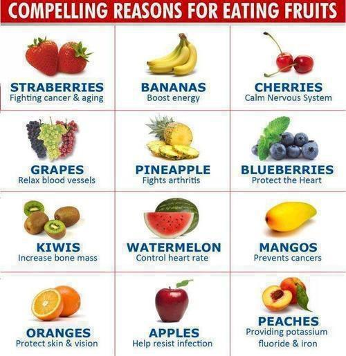
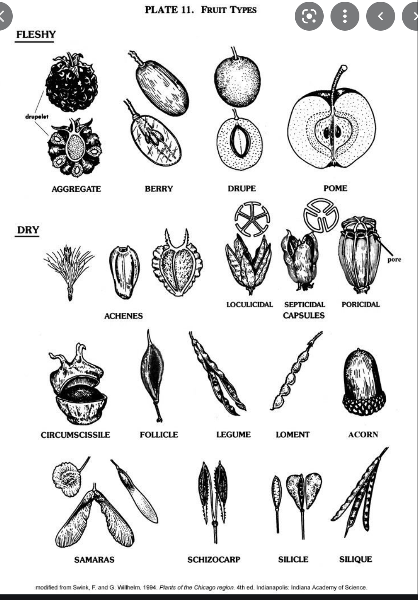
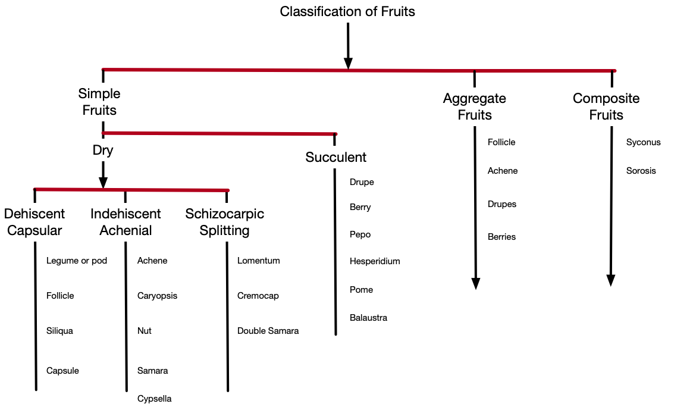

```{r setup, include=FALSE}
knitr::opts_chunk$set(echo = TRUE)
```


*** 

# Diversidad de Frutos

### ¿Cual es la diferencia en la definición entre "fruto" en el supermercado "fruto" en termino botanico?

### Frutos del supermercado




***

### Frutos en termino botanico

- [Tipos de Frutos: vea este documento](https://lizzieharper.co.uk/2014/04/botanical-terms-for-fruit-types/)




***

## Diagrama de Clasificaciones de frutos 



1. Identifica cual es la definiciones de estos frutos y encuentra en la web dos ejemplos (diferentes especies) de cada uno. Debería tener por los menos 3 tipo de clasificación por grupo (menos Frutos compuestos). 

2. Organiza tu trabajo en orden de clasificación 

***


## Referencias

 - [Tipos de Frutos: Terminos](https://www.ndsu.edu/pubweb/chiwonlee/plsc211/labmanual/lab12.PDF)
 - [Clasificación de frutos, por Spjut](http://www.worldbotanical.com/fruit_types.htm)
