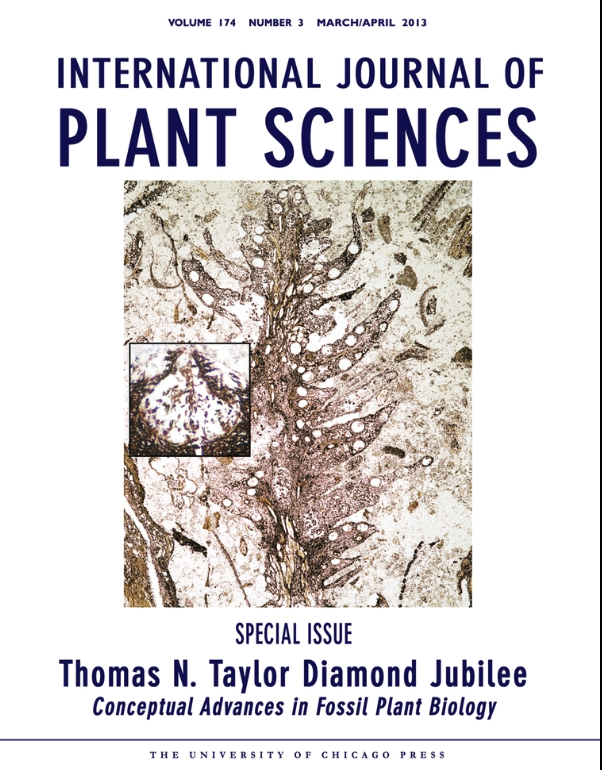

```{r setup, include=FALSE}
knitr::opts_chunk$set(echo = TRUE)
```

***

# Objetivos

- Este modulo tiene como objetivo hacer una breve introducción de los grupos taxonómicos de plantas extintas y 

- Un recorrido breve de los periodos y la diversificación de las plantas y sus características derivadas. 

- Un informe individual sobre algunas plantas extintas basado en fósiles. El informe se hará con literatura revisada por pares.

***

## Breve Introducción



***

Journal expecializado en Paleobotanica

[Review of PaleoBotany and Palynology](https://www.sciencedirect.com/journal/review-of-palaeobotany-and-palynology/about/aims-and-scope)

***

Temas

1. Evolución de los organismos del plantas (árbol filogénetico y tiempo)


2. Evolución de las plantas terrestres (árbol filogénetico y tiempo)


3. Características derivadas de los grupos principales.


Preguntas 1:

En que periodo estuvieron mayormente los animales acuáticos?

Preguntas 2: 

En que periodo estuvieron mayormente los dinosaurios?


Preguntas 3: 

Que tipo de plantas dominaba cuando durante la era de los dinosaurios?


### Temas de trabajo

 #### Cada estudiante tendrá un articulo asignado como base para comenzar su trabajo.
 
 - Se hara un trabajo escrito de 5 paginas
 - Se hara una presentación oral de 10 minutos.
 
Cada presentación/trabajo escrito incluirá una 

- introducción al articulo
  - su objetivo
  - su hallazgos
  - su resultados
- un mapa donde se encuentra los fósiles en el articulo
- un figura para poner claro en que **ERA** geológica se encuentra el tema del articulo.
- Se apoyará con artículos revisados por pares, no solamente el articulo original, y estos TIENEN que leerlos.  


Se usará el articulo como una base para expandir el trabajo, tendrá que utilizar en su trabajo **por lo menos 4** otras referencias revisado por pares.  *Los artículos NO revisado por pares NO se considerarán como valida*.

Para expandir su trabajo la mejor manera es 

 - ver/leer los artículos citado en el mismo
 - ver/leer los artículos citado por otros autores del articulo que UD leyó.
 - hacer una búsqueda en Google Scholar de las palabras claves del artículo leído
 


 
 
 
 


### Palabras claves para busqueda en Google Scholar

- Fossil plants
- Paleobotany
- First plants
- Earliest land plants
- Paleobotany review
- paleobotany evolution of plants
- Cropolites and Dinosaurs
- Algae and land plants

***

### Algunas referencias


[Paleobotany Dilcher 2001](PDF/Paleobotany_1.pdf)

[Cropolites and Dinosaurs](PDF/First report on vertebrate coprolites from the Upper Cretaceous (Santonian) Csehbánya 2 Formation of Iharkút, Hungary.pdf)

[The origin of life Cycle of Land Plants](PDF/The Origin of the Life Cycle of Land Plants: A simple modification in the life cycle of an extinct green alga is the likely origin of the first land plants | 10.2307:27853160.pdf)

[Algal Ancestor to land plants](PDF/Algal ancestor of land plants was preadapted for symbiosis.pdf)

[Aglaophyton](PDF/Four hundred-million-year-old vesicular arbuscular mycorrhizae. | 10.1073:pnas.91.25.11841.pdf)

[Phylogenetic relationships among early land plants](PDF/Phylogenetic Relationships between the Earliest Land Plants | 10.1016:j.cub.2018.01.034.pdf)

[Early land plants and Oxygen](PDF/Earliest land plants created modern levels of atmospheric oxygen.pdf)

[Microfossils of early land plants](PDF/The microfossil record of early land plants.pdf)

[Morphological Evolution in land plants](PDF/Morphological evolution in land plants- new designs with old genes.pdf)

[The Antillean paleocommunities](PDF/Historical biogeography of Caribbean plants- introduction to current know- ledge and possibilities from a phylogenetic perspective.pdf) Vea la referencias adentro en la sección de **Fossils and Paleovegetation**

[Photograpghy of plant fossiles](PDF/Photography of plant fossils—New techniques, old tricks | 10.1016:j.revpalbo.2011.05.001.pdf)

[Fossil plant record and global climate change](PDF/The fossil plant record and global climatic change.pdf)

[Mexico Fossils](PDF/Mexico- Assembling extinct plants from their isolated parts.pdf)

[The oldest fossil mushroom](PDF/The oldest fossil mushroom.pdf)

[PaleoBotany-Tracheophytes](PDF/Paleobotany of Land Plants.pdf) Concentrar en "Tracheophytes"

[PaleoBotany-Lycopods](PDF/Paleobotany of Land Plants.pdf) Concentrar en "Lycopods"

[PaleoBotany-Cycads](PDF/Paleobotany of Land Plants.pdf) Concentrar en "Cycads"

[PaleoBotany-Early Seed Plants](PDF/Paleobotany of Land Plants.pdf) Concentrar en "Early Seed Plants"
