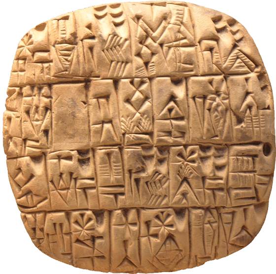
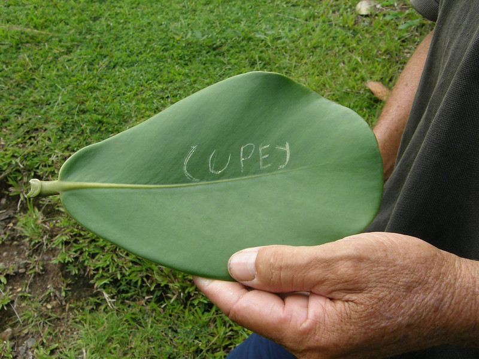
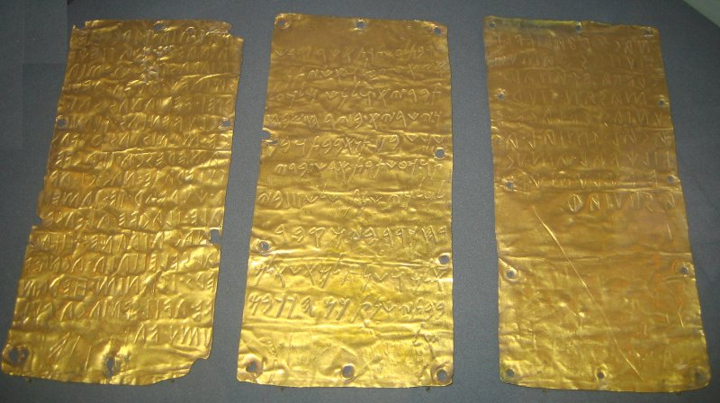
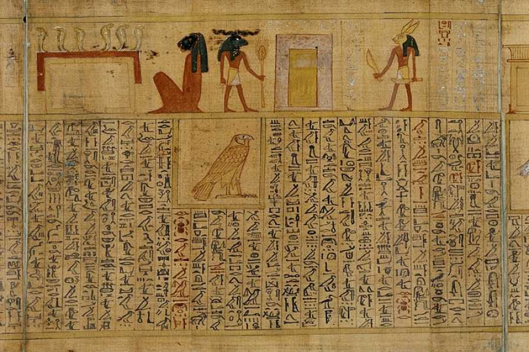
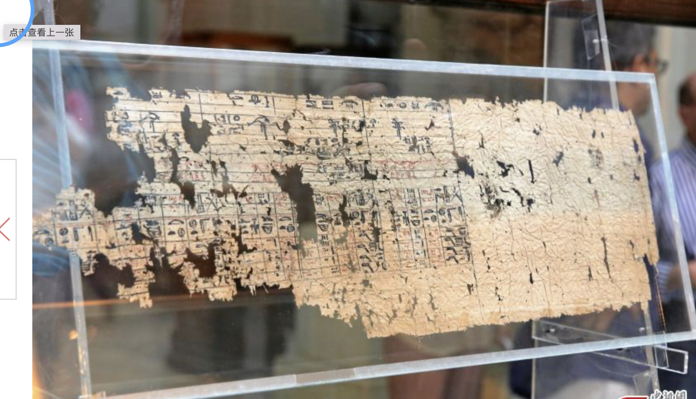
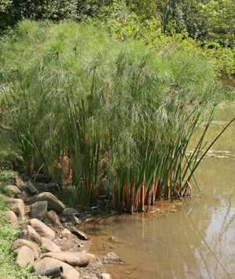
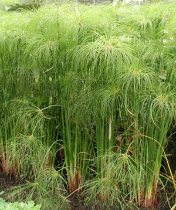

```{r setup, include=FALSE}
knitr::opts_chunk$set(echo = TRUE)
```

## Conocimiento Almacenado

Las bibliotecas son sitios de almacenamiento de conocimiento, donde información en forma escrita se encuentra preservado.  La ventaja de tener el conocimiento escrito es que esa no depende de un proceso oral de pasar la información.

En diferentes momentos en la historia humana se utilizo diferentes manera de transmitir la información escrita.  Por ejemplo hay evidencia de textos escritos en piedra, huesos, hojas de plantas y mármol. De esta forma podemos regresar a los textos escritos para conocer la información o re-evaluar cuando tenemos más información para comparar.    

- Por ejemplo este piedra que data de aproximadamente 3200BC en un lenguage llamado **Sumeriano**. 

La información proviene de la siguiente fuente [Oldest Languages](https://www.oldest.org/culture/written-languages/)




Nota aquí un mensaje enviado a España sobre hojas de Cupey. Hubo un momento que no había papel en Puerto Rico por consecuencia se uso otra alternativa para enviar mensajes de Puerto Rico a España cuando PR era una colonia de España.  

NO CONSEGUI un ejemplo de los mensajes enviados al rey de España




# Los libros más viejos

[Libros más viejos](https://wiganlanebooks.co.uk/blog/interesting/10-of-the-oldest-known-surviving-books-in-the-world/)

Los primeros libros fueron escrito sobre cuero (piel de animales), oro, sobre un precursor del papel, el *papyrus*. 





Un ejemplo de texto sobre papyrus con texto de egypto

[como hacer papurys](https://www.emotoursegypt.com/pt/activity/240310/papyrus-manufacturing-tour-and-learn-papyrus-making-in-egypt)


Texto sobre *Papyrus* más viejo

Aqui la planta de *Papyrus*




***

## Preservando plantas para el futuro

Preservar el conocimiento en el tiempo ayuda a conocer el pasado pero también entender y interpretar el presente. 


La razón que conocemos la diversidad sobre plantas en el planetas es que fueron preservado para que futuros científicos las pueden evaluar usando técnicas de secar las plantas, identificar donde fueron recolectas, en que año y tratar de identificar las especies.  En lo que sigue es un documento para comenzar su propio herbario de plantas.  

Por ejemplo preguntas que se puede hacer con colección de herbarios

- Donde se encuentra ciertas especies
- Cual son los tipos de hábitat más susceptible para la conservación de las plantas
- Identificar las especies invasivas y el momento que comenzaron a invadir nuevas áreas.
- Conocer la diversidad de especies por familia y por área geográficas
- Para análisis de filogenéticos y evolutivos


## Qué es un Herbario


Los herbarios más antiguos se encuentran en Kasses, Alemania (fundada en 1569) y Bolonia, Italia (fundada en 1570). 

La plantas preservadas se encuentra en un **Herbario**.  Visita el siguiente enlace para una pequeña introducción sobre lo que es un Herbario. [Herbarium](https://en.wikipedia.org/wiki/Herbarium). 

## Algunos de los herbarios más grande

Aqui un enlace de algunos herbarios más grande. Los herbarios del mundo contienen más de 273 millones de especímenes en más de 2600 herbarios en 147 países

[Herbarios grandes](https://www.floridamuseum.ufl.edu/herbarium/herbariaandspecimens.htm)

 - Cuantas especímenes tiene el Herbario del Museo de Historia Natural de Paris?

## Colección importante del Caribe

Uno de los primeros exploradores en el caribe fue **Hans Sloane** que viajo a Jamaica y hizo una colección de plantas incluyendo *Theobroma cacao*, la planta que nos da el cacao, o sea el chocolate.   Sloane se hizo bien rico por haber descubierto el cacao y reconocer su uso.  

Vea este website para el ver el espécimen original de la planta de cacao

[Cacao](https://www.nhm.ac.uk/our-science/collections/botany-collections/historical-botanical-collections/sir-hans-sloane-jamaican-collections.html)


## Enlace para el Herbario de Puerto Rico

Aqui esta el enlace del Herbario de Puerto Rico

Enlace #1

[Herbario PR](http://herbario.uprrp.edu/)

Enlace#2

[Herbario2](http://herbario.uprrp.edu/bol/)

- Cuantas especímenes tiene el herbario de Puerto Rico? 
- En que año fue fundado?
- Cual es la familia de planta que tiene mayor especimenes?


## Ejemplos de plantas en herbarios 

### El herbario personal más viejo 

Aquí un Herbario personal del 1633: Mira múltiples laminas

[Flemish Bernardus Wynhouts](https://lib.ugent.be/viewer/archive.ugent.be:500C7CB6-DFDB-11E5-9D50-9943D43445F2#?c=&m=&s=&cv=2&xywh=-625%2C-1%2C11074%2C7458)

#### Linnaeus

Herbario de Carlos Linnaeus

Una pagina de Web dedicado a las colección de [Linnaeus](http://linnaeus.nrm.se/botany/fbo/welcome.html.en)


***

### Como preparar plantas para un herbario

Vea el siguiente Vídeo

1. El primer video es de uno de los Herbarios más grande del mundo, se observa el proceso de preparar un espécimen para un herbario.

[Como preparar un herbario](https://www.rbge.org.uk/science-and-conservation/herbarium/specimen-preparation-care/preparation-of-specimens/)

2. El segundo vídeo enseña como Ud puede preparar herbario de plantas en su casa

[Herbario casero](https://www.nybg.org/planttalk/herbarium-at-home-a-beginners-guide/)

3. En este website se encuentra la información escrita para repasa la información en los vídeos. 

[Florida Herbarium](https://www.floridamuseum.ufl.edu/herbarium/methods/mountingguide.htm)

# Sumamente importante

**Nota la información importante que debería tener el label**.

[Herbarium label](https://www.uwgb.edu/biodiversity/herbarium/herbariumLabel01.htm).

[Herbarium Label 2](https://www.oshibana.com/herbarium/en/index.php/about-plant-specimens/labeling)

***

# Tarea que entregar. 

#### Por cada planta bien montada, identificada y esteticamente bien preprada hay un maximó de 7 puntos (un máximo de 49 puntos). 

Basado en las familias de plantas aprendida la semana pasada.

 - Selecciona 7 especies, 
 - Solamente una especie por familia de plantas. 
 - Preparar adecuadamente las plantas como vieron en los vídeos
    - Secar las plantas.
    - Montar las plantas en una cartulina (fueron secada 2-3 semanas antes).
    - Nota que las plantas seleccionada tienen que tener mínimo o flores o frutas (preferiblemente ambas).
    - Añadir su *label* con toda sus partes, como aparece en los ejemplos.  Usar la información disponible como el *Vademecum* para identificar las plantas y el Herbario de la UPR Río Piedras, vea enlace arriba.    
    
### NOTA: No se considerará ninguna planta que no este seca.  

**Después de su colección las plantas toman de 2-3 semanas a secar en Puerto Rico**

***

# Entrega del trabajo el 30 de noviembre a la 12 del medio dia

 - **Opción 1**: se entregará en mi oficina (Asumiendo que el recinto este abierto)
 - **Opción 2**: se entregará entre 11am y 12 del medio dia el 30 de noviembre en el estacionamiento al lado de CHURCH, al frente del recinto. 


