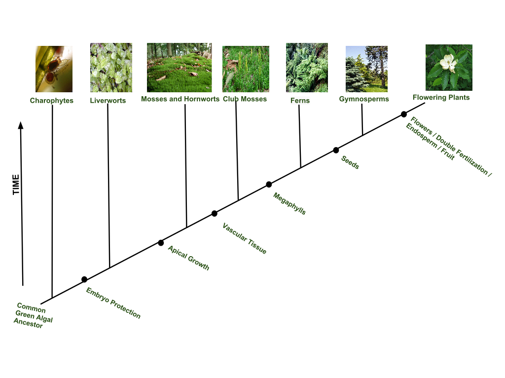
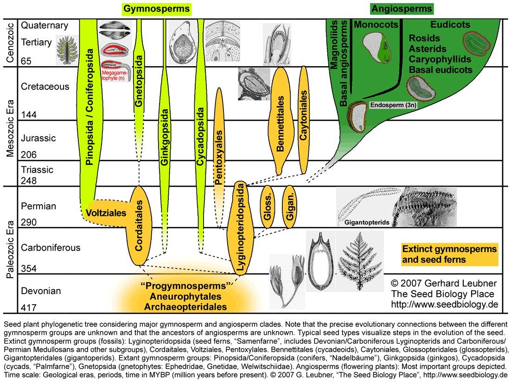
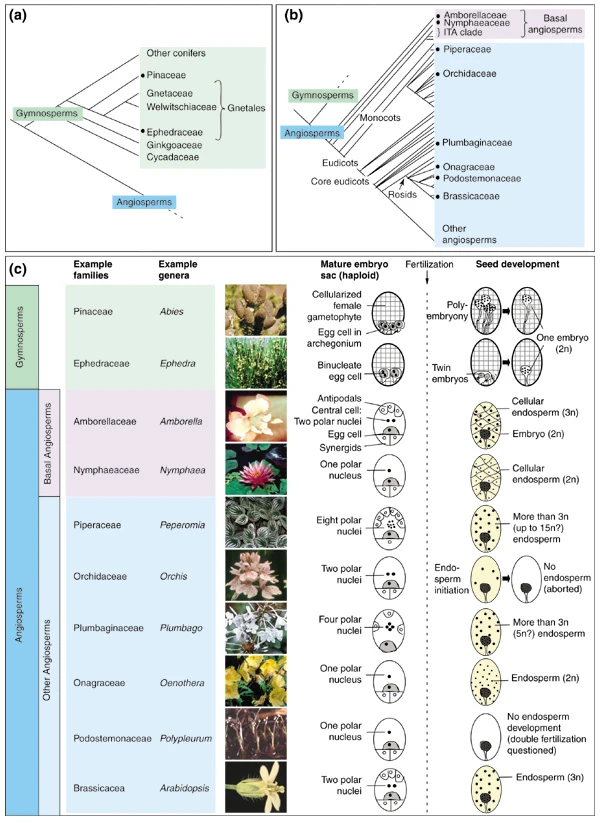
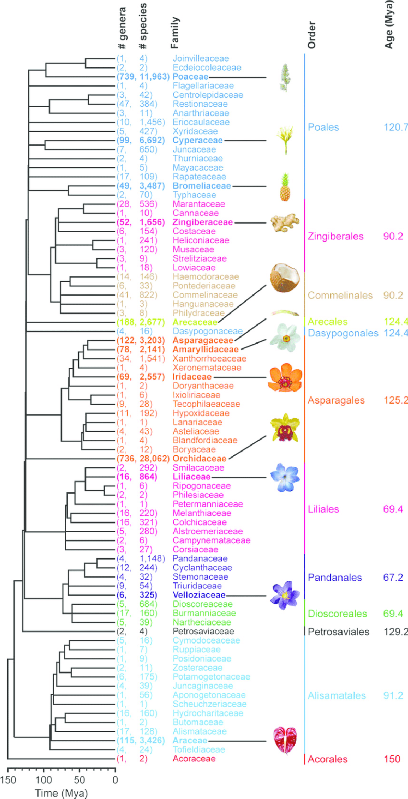

```{r setup, include=FALSE}
knitr::opts_chunk$set(echo = TRUE)
```


***

Taxonomia de plantas y la evolución de de los grupos taxonomicos.

Los grupos están organizado en el proceso evolutivo basado en "caracteristicas derivadas compartidas".


Aqui un árbol basico de los grupos principales de la evoluación de las plantas


Sitio de la figura (https://commons.wikimedia.org/wiki/File:Plant_Diversity_(2).svg)


NOTA los puntos importante en el proceso evolutivos

 -  Protección del embryo
 -  Crecimiento apical
 - Tejido vascular
 - Megaphylls (Hojas)
 - Semillas
 - Flores/ fertilización doble/ Endosperma/ frutos
 
 ***
 
 Evolución de plantas con semillas
 
 
 
 Sitio de la grafica (http://www.seedbiology.eu/evolution.asp)
 
****

# Evolución de Angiosperma 
 
 

 


***

# Evolución de los Monocots
 

 
sitio de la figura (https://www.researchgate.net/publication/309658762_Global_monocot_diversification_Geography_explains_variation_in_species_richness_better_than_environment_or_biology)
 
 
 
*** 

## Reconociendo 20 familias de plantas en el recinto

***

### Monocots

#### Poaceae

#### Cyperaceae


***

### Eudicots

#### Asteraceae

#### Euphorbiaceae


#### Rubiaceae


#### Annonaceae
   - *Anona* 

#### Bignoniaceae 
  - *Spathodea campanulata*
    
    

#### Cacteceae


 
 
 
    


 
 
 
