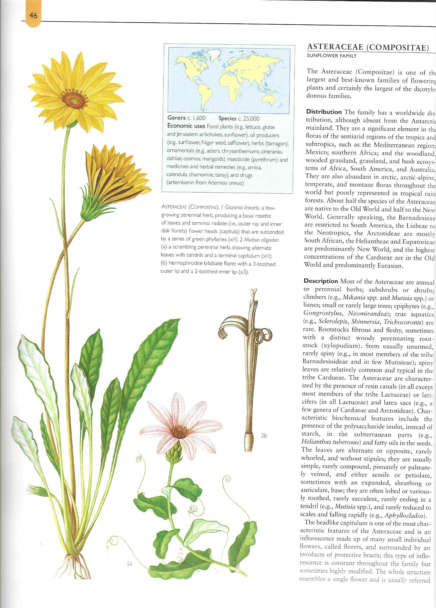
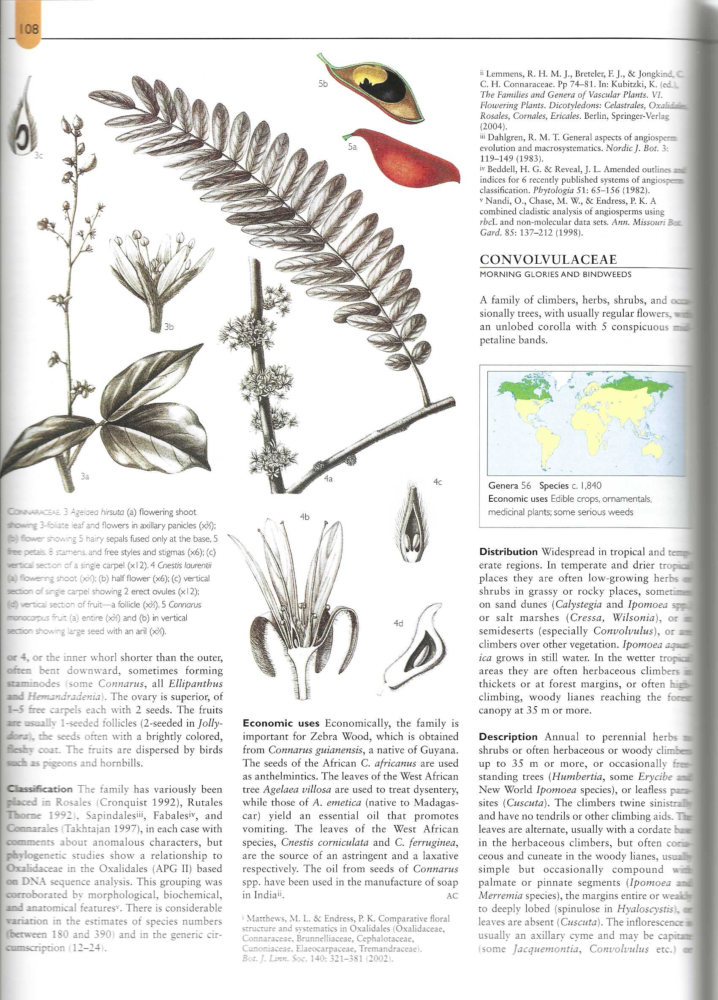
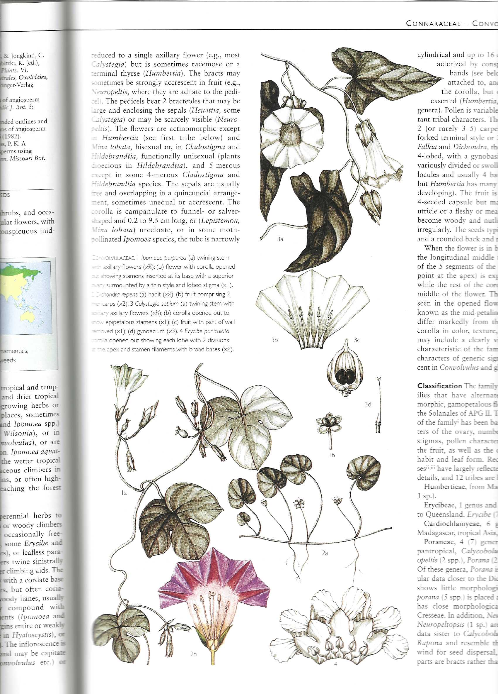
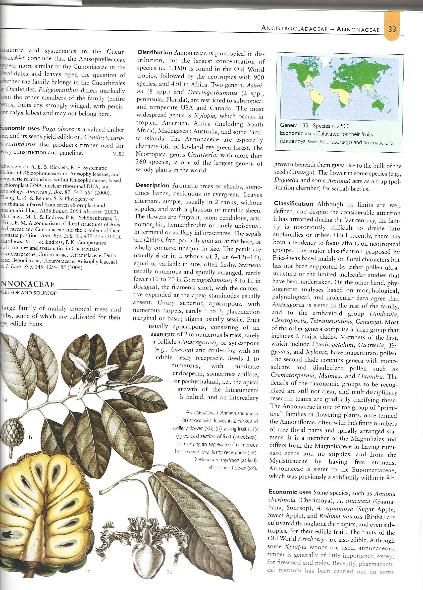
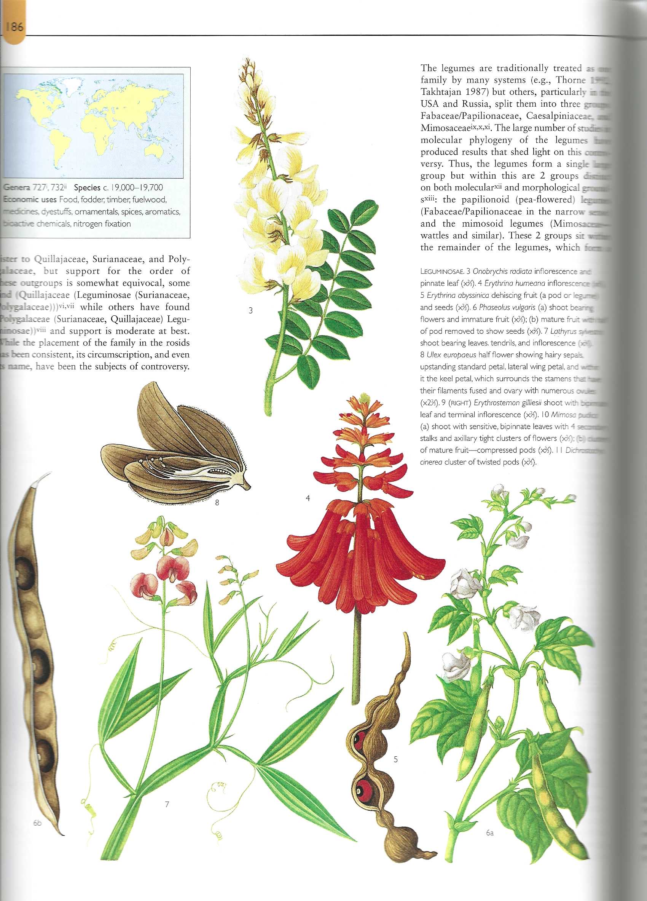

```{r setup, include=FALSE}
knitr::opts_chunk$set(echo = TRUE)
```


***

Taxonomia de plantas y la evolución de de los grupos taxonomicos.

Los grupos están organizado en el proceso evolutivo basado en "caracteristicas derivadas compartidas".


Aqui un árbol basico de los grupos principales de la evoluación de las plantas


Sitio de la figura (https://commons.wikimedia.org/wiki/File:Plant_Diversity_(2).svg)


NOTA los puntos importante en el proceso evolutivos

 -  Protección del embryo
 -  Crecimiento apical
 - Tejido vascular
 - Megaphylls (Hojas)
 - Semillas
 - Flores/ fertilización doble/ Endosperma/ frutos
 
 ***
 
 Evolución de plantas con semillas
 
 
 
 Sitio de la grafica (http://www.seedbiology.eu/evolution.asp)
 
****

# Evolución de Angiosperma 
 
 

 


***

# Evolución de los Monocots
 

 
sitio de la figura (https://www.researchgate.net/publication/309658762_Global_monocot_diversification_Geography_explains_variation_in_species_richness_better_than_environment_or_biology)
 
 
 
*** 

## Reconociendo ±15 familias de plantas en el recinto

Todas las laminas abajo son del siguiente libro **Flowering PLant Families of the World** por V.H. Heywood, R. K. Brummit, A. Culham y O Seberg. Publicado por Firefly books, Ltd. 2007. 

***

### Monocots

### Arecaceae == Palmae

[WIKIPEDIA Arecaceae](https://en.wikipedia.org/wiki/Arecaceae)


***

### Bromeliaceae

[WIKIPEDIA Bromeliaceae](https://en.wikipedia.org/wiki/Bromeliaceae)


***

### Orchidaceae

[WIKIPEDIA Orchidaceae](https://en.wikipedia.org/wiki/Orchidaceae)


***


### Poaceae

[WIKIPEDIA Poaceae](https://en.wikipedia.org/wiki/Poaceae)


***

### Cyperaceae

[WIKIPEDIA Cyperaceae](https://en.wikipedia.org/wiki/Cyperaceae)


***

### Eudicots

Vea aquí la definición que agrupa las familias abajo

[Wikipedia Eudicots](https://en.wikipedia.org/wiki/Eudicots#:~:text=The%20eudicots%2C%20Eudicotidae%20or%20eudicotyledons,The%20term%20derives%20from%20Dicotyledons.&text=Numerous%20familiar%20plants%20are%20eudicots,plants%2C%20trees%2C%20and%20ornamentals.)

***

### Asteraceae

[WIKIPEDIA ASTERACEAE](https://en.wikipedia.org/wiki/Asteraceae)





***

### Bignonaceae

[WIKIPEDIA Bignonaceae](https://en.wikipedia.org/wiki/Bignoniaceae)


***

### Cacteceae

[WIKIPEDIA  Cacteceae](https://en.wikipedia.org/wiki/Cactus)


***

### Convolvulaceae

[WIKIPEDIA  Convolvulaceae](https://en.wikipedia.org/wiki/Convolvulaceae)






***

### Annonaceae

[WIKIPEDIA ANNONACEAE](https://en.wikipedia.org/wiki/Annonaceae)
   - *Anona* 




***

### Euphorbiaceae

[WIKIPEDIA Euphorbiaceae](https://en.wikipedia.org/wiki/Euphorbiaceae)


***

### Fabaceae == Leguminosae

[WIKIPEDIA Fabaceae](https://en.wikipedia.org/wiki/Fabaceae)





***


 
    


 
 
 
